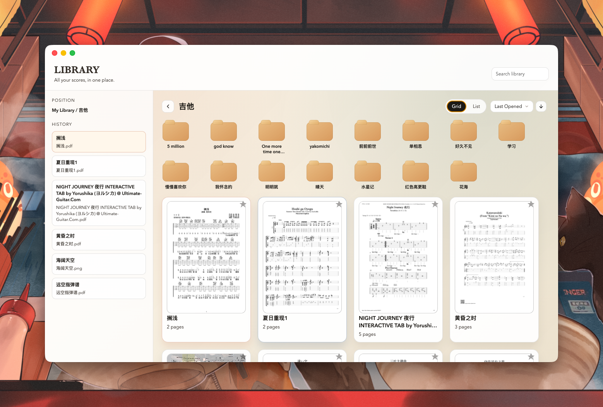
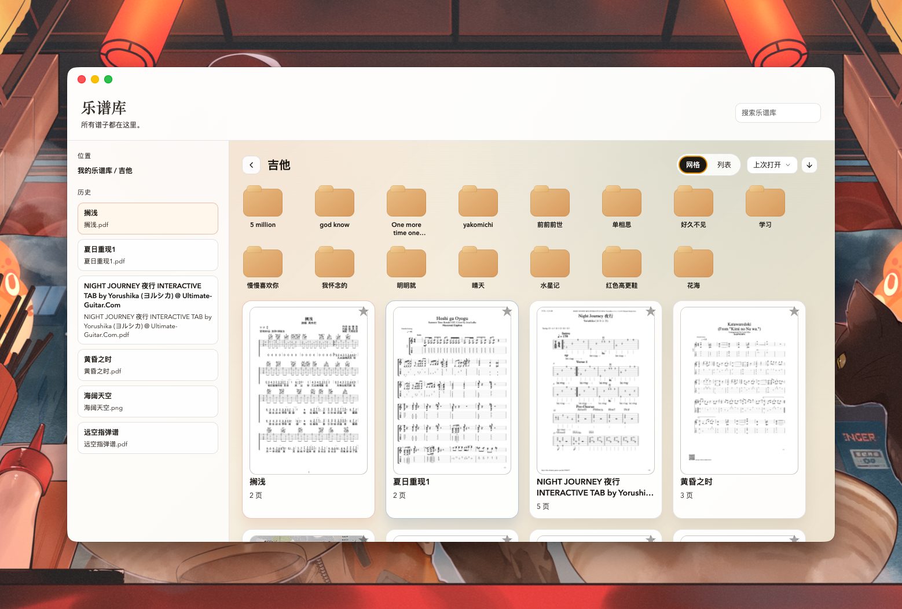
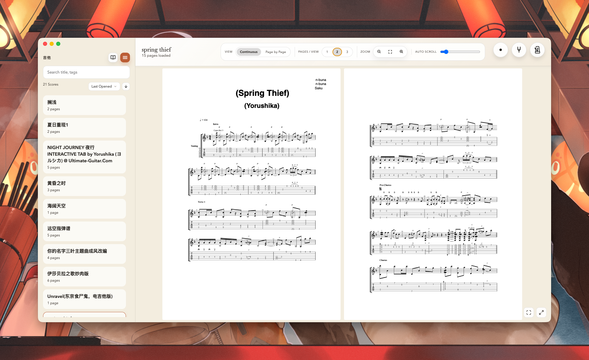
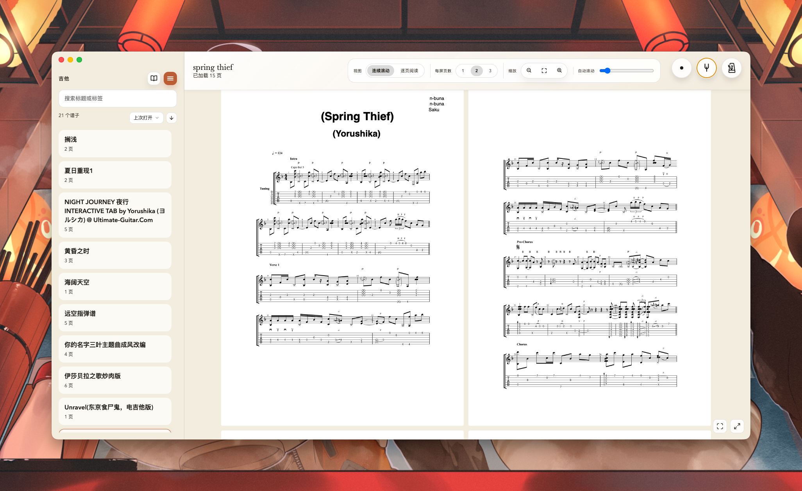
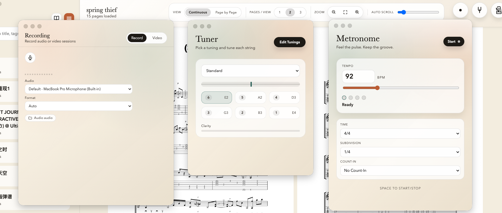
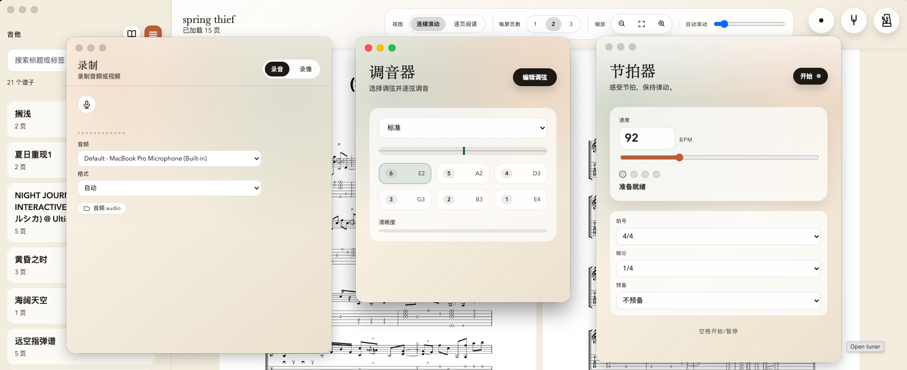

# AI Guitar Reader

**Language:** English | [中文](#ai-吉他阅读器)

A macOS desktop app for guitar scores: **library management + focused reading + practice tools**.  
License: MIT

## Screenshots







## Core Reader Features
- **Continuous & single-page modes** with quick switching
- **Auto scroll / auto page turn** for hands‑free practice
- **Zoom controls** + “fit to view”
- **Focus mode** + **fullscreen** for distraction‑free reading
- **Image stacks**: open multiple images as one scrollable/flip‑able score
- **Sidebar library**: search, sort, and jump between scores while reading

## Highlights
- **Library**: folders + scores in grid/list, search, sorting, favorites, recent history
- **Metronome & tuner**: dedicated windows for practice
- **Recording**: audio/video recording window, device & format selection, live waveform
- **Bilingual UI**: English / 中文 (Settings)

## Tech Stack
- Electron 40 + Vite + React
- SQLite（本地谱库索引）
- PDF.js（PDF 渲染）
- PDFKit CLI（页数/缩略图渲染）

## Development
Recommended: macOS + Node.js 20+

Install dependencies:
```bash
npm install
```

Development (Vite + Electron):
```bash
npm run dev
```

Build renderer:
```bash
npm run build:renderer
```

## Packaging (macOS)
```bash
npm run pack:mac
```
Output:
```
release/AI-Guitar-Reader.dmg
release/mac-arm64/AI Guitar Reader.app
```

> This is **unsigned / not notarized**. Gatekeeper may block first launch.  
> Go to **System Settings → Privacy & Security** and click “Open Anyway”.

## Permissions (macOS)
The app requests:
- **Microphone**: tuner + recording
- **Camera**: video recording

If denied, use the “Open System Settings” button in-app.

## Local Data Locations
- Library: `~/Library/Application Support/ai-guitar-reader/library`
- Database: `~/Library/Application Support/ai-guitar-reader/library.sqlite`
- Cache: `~/Library/Application Support/ai-guitar-reader/LibraryCache`
- Recordings: `~/Library/Application Support/ai-guitar-reader/recordings`

## Scripts
```bash
npm run dev          # 开发模式
npm run build        # 构建渲染层 + pdfkit-cli
npm run pack:mac     # 打包 DMG
```

## Contributing
Issues and PRs are welcome. Please keep UI consistency and avoid breaking library data layout.

## License
MIT

---

# AI 吉他阅读器

**语言切换：** [English](#ai-guitar-reader) | 中文

面向吉他谱的 macOS 桌面应用：**谱库管理 + 专注阅读 + 练习工具**。  
开源协议：MIT

## 预览截图


## 阅读器核心功能
- **连续/逐页** 两种阅读模式快速切换
- **自动滚动 / 自动翻页**，解放双手练习
- **缩放** + **一键适配**
- **专注模式** + **全屏**
- **图片合并阅读**：多张图片合成为一份可滚动/翻页谱
- **侧边栏谱库**：阅读时可搜索、排序、快速切换谱子

## 主要功能
- **Library 管理**：文件夹/谱子双模式（网格/列表）、搜索、排序、收藏、最近打开
- **节拍器 & 调音器**：独立窗口、练习辅助
- **录音/录像**：独立窗口、设备选择、格式选择、实时波形
- **双语界面**：English / 中文（Settings）

## 技术栈
- Electron 40 + Vite + React
- SQLite（本地谱库索引）
- PDF.js（PDF 渲染）
- PDFKit CLI（页数/缩略图渲染）

## 开发环境
推荐：macOS + Node.js 20+

安装依赖：
```bash
npm install
```

开发模式（Vite + Electron）：
```bash
npm run dev
```

构建渲染层：
```bash
npm run build:renderer
```

## 打包（macOS）
```bash
npm run pack:mac
```
输出位置：
```
release/AI-Guitar-Reader.dmg
release/mac-arm64/AI Guitar Reader.app
```

> 当前为**未签名/未公证**版本。首次打开可能被 Gatekeeper 拦截，请在  
> 「系统设置 → 隐私与安全」中点击“仍要打开”。

## 权限说明（macOS）
应用会请求：
- **麦克风**：调音器与录音
- **摄像头**：录像

若被拒绝，可在界面中点击“打开系统设置”跳转到权限页。

## 本地数据位置
- 谱库文件夹：`~/Library/Application Support/ai-guitar-reader/library`
- 数据库：`~/Library/Application Support/ai-guitar-reader/library.sqlite`
- 缓存：`~/Library/Application Support/ai-guitar-reader/LibraryCache`
- 录音：`~/Library/Application Support/ai-guitar-reader/recordings`

## 常用脚本
```bash
npm run dev          # 开发模式
npm run build        # 构建渲染层 + pdfkit-cli
npm run pack:mac     # 打包 DMG
```

## 贡献
欢迎 Issue / PR。提交前建议：
- 保持 UI 风格一致
- 避免破坏本地谱库结构

## License
MIT
